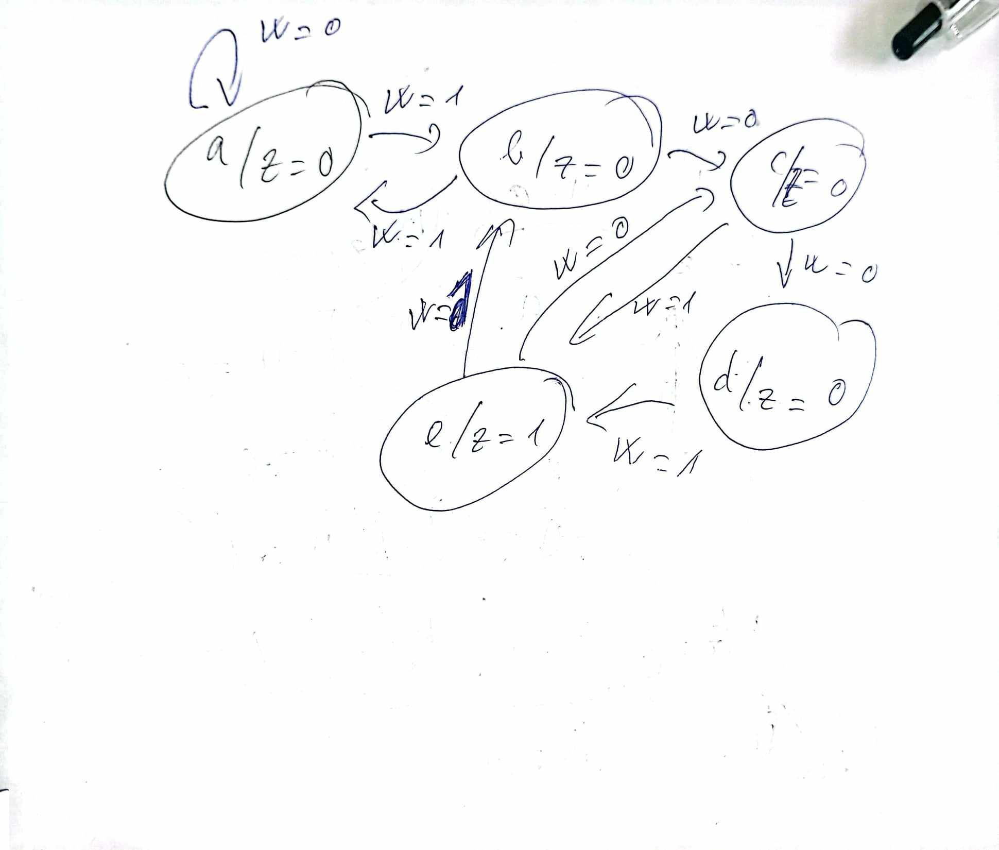
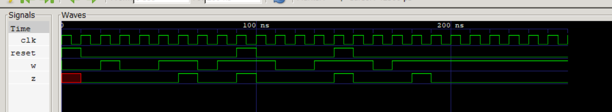

**Design a sequence detector circuit that operates as follows:**
1. The circuit has 1 input signal w, 1 output signal z, 1 clock signal
clk (rising edge), 1 reset signal active high
2. Output signal z = 1 if input sequence w = “1001” or w = “101”
3. Otherwise, the output signal z = 0
**Requirements:**
1. Draw the block diagram of the circuit/FSM
2. Draw the state transition diagram of the FSM (Hint: 5 states)
3. Write Verilog HDL code for the FSM
4. Write test bench to verify the operation of the FSM
## FSM Diagram

## Wave
 
